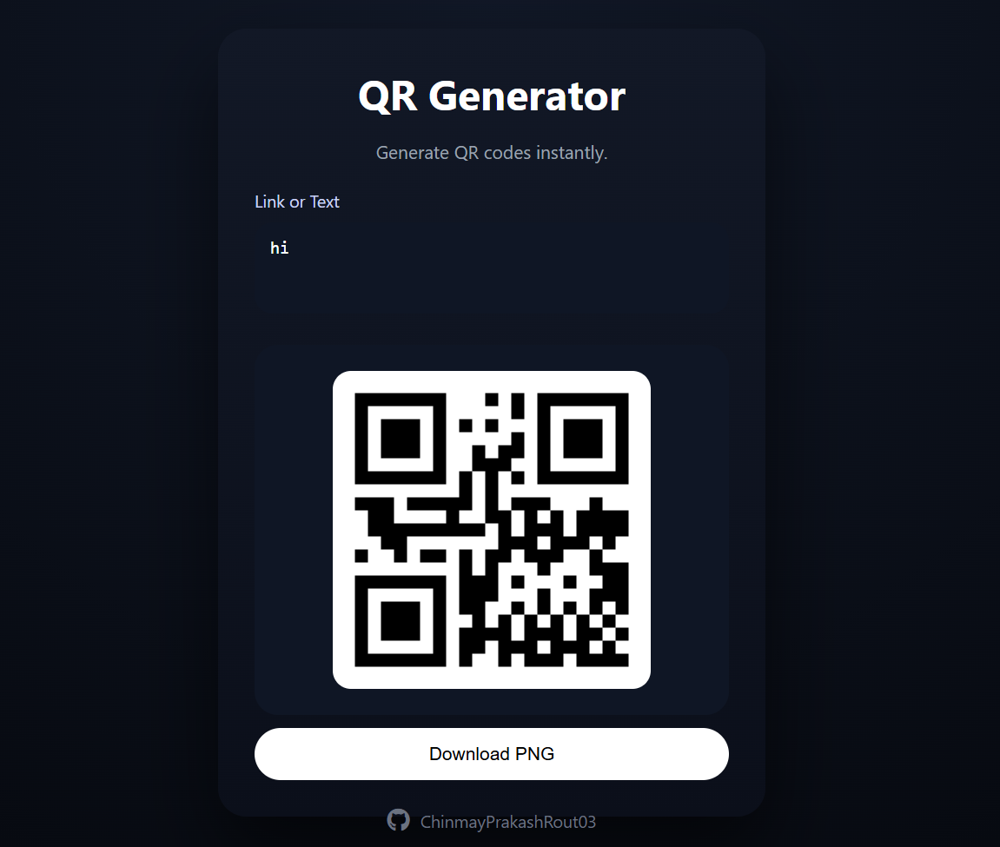

# Day 1 – QR Code Generator (Text → QR)

## 📌 Project Overview
This project is my Day 1 submission for the **30 Days – 30 Projects** challenge.

It is a simple and clean QR Code Generator that converts any text or URL into a downloadable QR code directly in the browser using HTML, CSS, and JavaScript.

The focus of this project was strengthening core JavaScript concepts while building a complete, functional web application from scratch.

---

## ❓ Why I Chose This Topic
I selected this project because QR codes are widely used in real-world applications such as payments, authentication, digital menus, and quick link sharing.

It also provided a practical way to:
- Practice DOM manipulation
- Work with event handling
- Build an interactive UI
- Deliver a usable utility application

---

## 🎯 Motive / Goal
The primary goals were:
- Understand the basic concept of QR encoding
- Build a functional app using only HTML, CSS, and JavaScript
- Design a clean, minimal macOS-inspired interface
- Write readable and structured JavaScript logic

---

## 🌍 Impact
This project demonstrates:
- Strong front-end fundamentals
- Ability to build utility-based web applications
- Clean UI design practices
- Structured and maintainable JavaScript code

It also marks the successful completion of the first project in my 30-day development challenge.

---

## 🖼 Preview

---

## 🤝 Resources Used
- Official documentation of the QR library
- MDN Web Docs for JavaScript reference
- Debugging and iterative development during implementation

---

## 👤 Author
**Chinmay Prakash Rout**  
30 Days – 30 Projects | Day 1